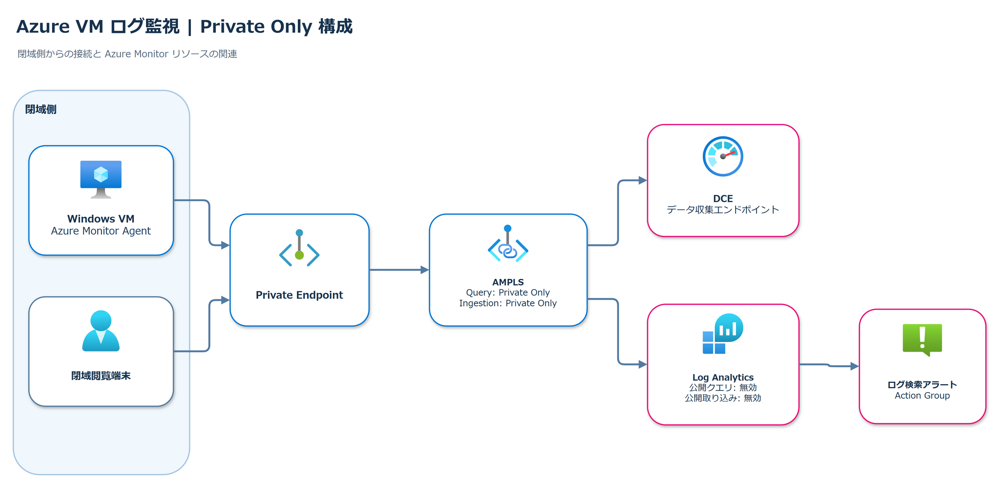

# Azure VM ログ監視 / AMPLS ハンズオン

Windows VM のイベントログを Azure Monitor Agent（AMA）とデータ収集ルール（DCR）で Log Analytics に収集し、閉域での閲覧とアラート通知を検証するための手順書です。

- VM の AMA は DCE から構成を取得し、収集したログを Log Analytics に送信します。
- 閉域閲覧端末は Private Endpoint 経由で Log Analytics をクエリします。
- 完成形では AMPLS の Query / Ingestion を `Private Only`、Log Analytics の公開クエリ / 公開取り込みを無効にします。

詳細は [Azure portal 操作手順書](verification/2026-09-27-azure-vm-dcr-ampls-portal-runbook.md) を参照してください。
構成図の編集用原本は [draw.io ファイル](assets/azure-vm-dcr-ampls-private-only.drawio) です。

**状態:** デプロイ・動作検証は未実施です。
